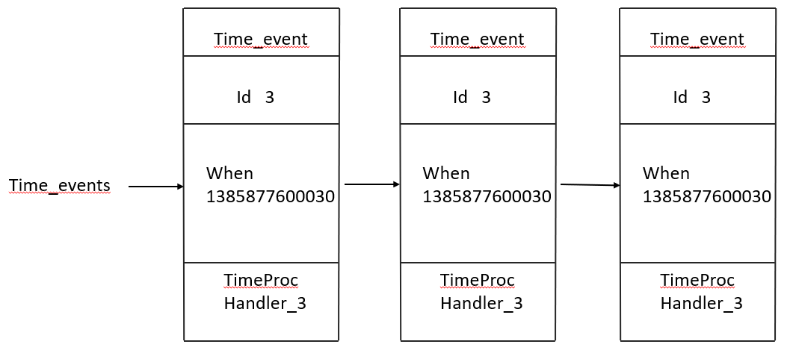
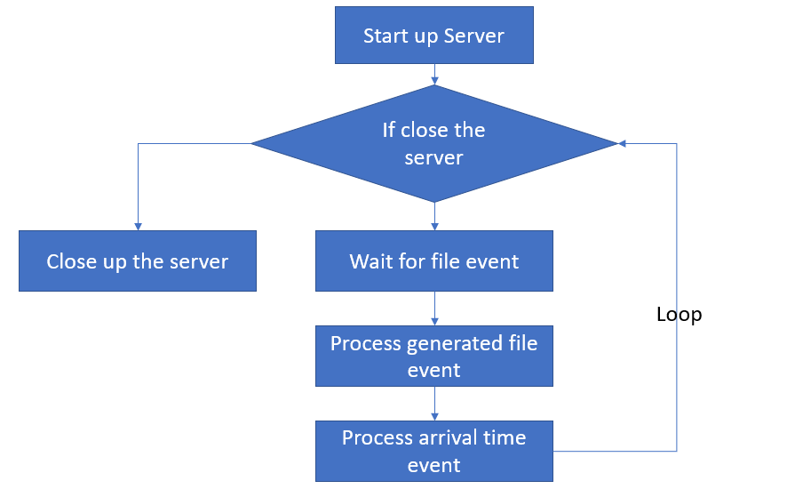

## What is  time event?

A timed-event is divided into two categories:

```
1. Timed event 
	A timed event can be set to make the program to execute once after a specified time.
2. periodic event
	A periodic event can let the program to execute every specified time.
```

A time-event consists of three parts: 

```
1. id. Id is a global unique identify. The ID number is incremented from small to large.
2. When. The Unix timestamp with milisecond precision , records the arrival time of the event.
3. TimeProc. Time event processor, a function. When the time arrives, TimeProc will be called for processing the event.
```

Whether a time event is a timed event or periodic event **depends on** the return value of the Time event processor.

```
If the time event processor returns ae.h/AE_NOMORE, the event will be defined as a timed event. This event will be deleted once it arrived and won't arrive any more.
If the time event processor retuerns a non ae.h/AE_NOMORE integer, the event will be defined as a periodic event. When a time event arrives, the server will update the event's when attribution by the return value of the time event processor to make the event arrive again next time again and again.
```

## How to implement the time event

**All the time event will be put into a  unordered linked list **. When  the time event actuator runs, it traverse the whole linked list, and search for all the events that has arrived and call the correspond TimeProc.



Notice that the unorder linked list means that each time event's "when" attribution is unordered but not its id. So the time event actuator must traverse the entire linked list to find out the event that match the "When" time.

### What can the time event do?

The time event can be used for checking the system state and maintain the system regularly.

Let's take serverCron function as an example:

```
+ Update various statistical information of the server, such as time, memory occupation, database occupation, etc.
+ clean up the expired key-value pairs in the database.
+ close and clean up clients whose connections have been invalid.
+ An AOF or RDB persistence operation was attempted.
+ If the Server is the main server, synchronize the work server periodically.
+ If the server is in the Cluster mode, perform periodic synchronization and connection tests on the cluster.
```

The redis server will run the serverCron function in the form of periodic events.  During the operation of the server, serverCron will execute once every other period of time until the server is shut down.

Because there are two types of events in the sever: file event and time event, the server must schedule these two events to decide when to deal with file events, when to deal with time events, and how much time to deal with them.

Use ae.c/aeProcessEvents function to deal with them: [aeProcessEvents](aeProcessEvents.md)

Put this function in a loop of the main funciton, then a event processor has been built.

```
def main(): # Use Pseudo code
	init_server()
	while server_is_not_shutdown():
		aeProcessEvents()
	clearn_server()
```



[Redis中的时间事件](https://blog.csdn.net/m0_58554082/article/details/119733143)

[redis文件事件和时间事件](https://blog.csdn.net/qq_40223554/article/details/119900973)
